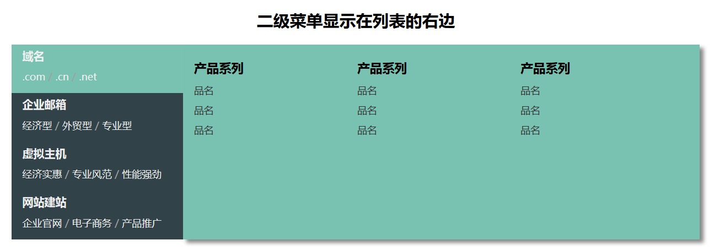
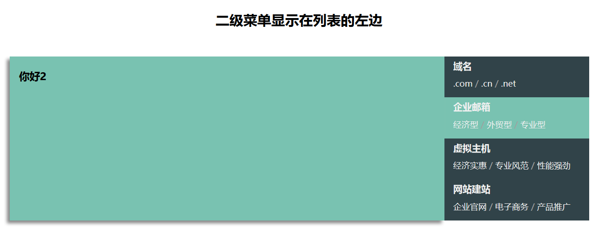

# nicemenu

一个漂亮的jquery菜单插件，可以轻松的完成类似淘宝、京东、小米等电商类的商品多目录分级样式。




## 功能特点

* 兼容IE8+（兼容IE8时，需要使用jquery 1.x）。
* 多个二级菜单的显示位置。
* 核心控制样式和主题样式分离。
* MIT授权，可随意使用。
* 代码结构清晰，使用方便。
* 预定义的多个主题样式，直接拷贝，极速呈现！
* 将来会添加更多主题样式，方便大家使用。

## 核心类

* `.nicemenu`[`data-pos`=`...` `data-classes`=`...`]
    * `.nicemenu-list` 或 `.nicemenu-list.verticle`
	    * `.nicemenu-item`
	        * `.nicemenu-sub`
	    * `.nicemenu-item`
	        * `.nicemenu-sub`
	    * `.nicemenu-item`
	        * `.nicemenu-sub`
## 用法

### 1. 在head中插入样式：

```html
<head>
  <link rel="stylesheet" href="<path>/nicemenu.css">
  <link rel="stylesheet" href="<path>/nicemenu.theme.css">
</head>
```

> - **nicemenu.css** 是核心样式，一般保留原样，不要修改
> - **nicemenu.theme.css** 是主题样式，用于设计不同的主题，可以自行设计

### 2. 在body中加入 `div.nicemenu`

```html
<body>
  <div class="nicemenu" data-pos="二级菜单的显示位置" data-classes="一个或多个类">
    ...
  </div>
</body>
```

> - **data-pos** 是二级菜单将要显示的位置，取值可为 `list.right`, `list.left`, `list.bottom`, `list.top`，如果没有设置，默认为 `list.right`。
> - **data-classes** 是当鼠标进入一级菜单时，二级菜单将要应用的类。如果没有设置，默认为 `active`。

### 3. 加入一级菜单和二级菜单的内容

```html
<div class="nicemenu" data-pos="二级菜单的显示位置" data-classes="一个或多个类">
  <div class="nicemenu-list">
    <div class="nicemenu-item">
      <h6>大标题</h6>
      <p>小标题</p>
      <div class="nicemenu-sub">
        二级菜单内容
      </div>
    </div>

    <div class="nicemenu-item">
      <h6>大标题</h6>
      <p>小标题</p>
      <div class="nicemenu-sub">
        二级菜单内容
      </div>
    </div>

    <div class="nicemenu-item">
      <h6>大标题</h6>
      <p>小标题</p>
      <div class="nicemenu-sub">
        二级菜单内容
      </div>
    </div>
  </div>
</div>
```

> 一级菜单中的大标题设为`h6`，小标题设为`p`，只是演示而已。可根据自己需要，在 nicemenu.theme.css 文件中自行定义需要的样式。

### 4. 导入jquery和jquery.nicemenu.js，然后应用。

```html
<body>
  <!-- 前面已经添加好了的HTML内容 -->

  <script src="<path>/jquery.min.js"></script>
  <script src="<path>/jquery.nicemenu.min.js"></script>
  <script>
    $(".nicemenu").nicemenu();
  </script>
</body>
```

### 5. 完成！

## 一起参与

欢迎大家一起参与持续改进这个前端库，如果发现任何bug或者提出任何建议，欢迎提交PR。

## 版权

MIT授权，可以自由商用，但是请保留原始版权信息，谢谢大家！

作者： 刘念 <https://github.com/maccliu/>
Copyright (c) 2017 [Zeupin LLC](http://zeupin.com)